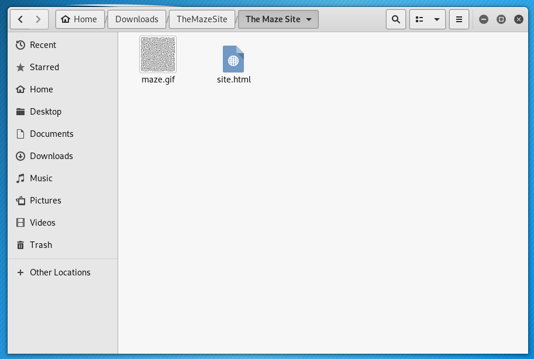
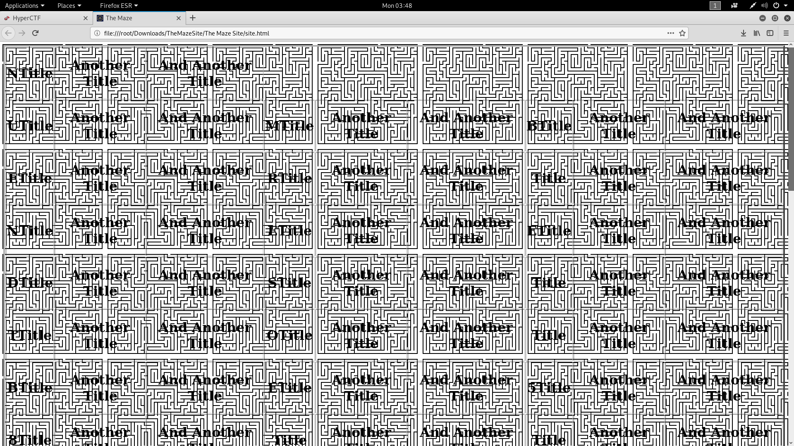
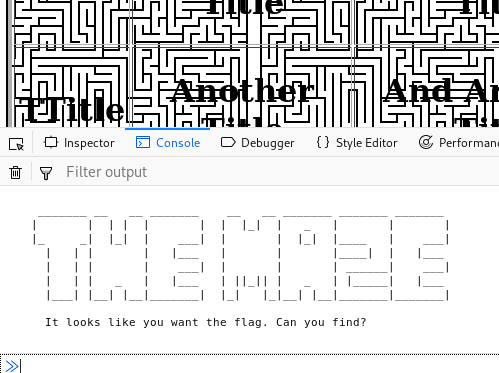
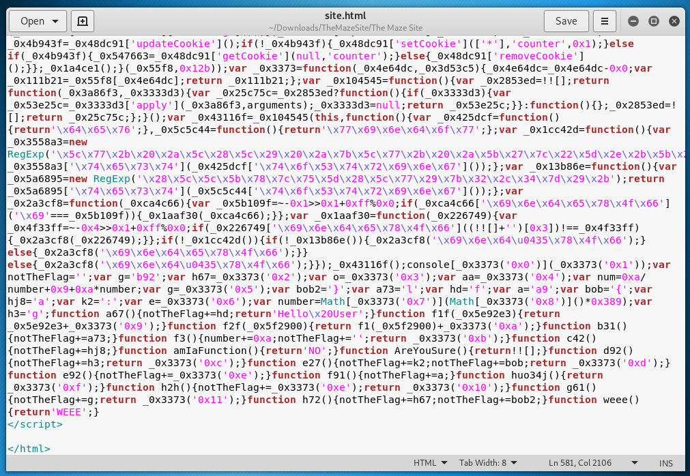
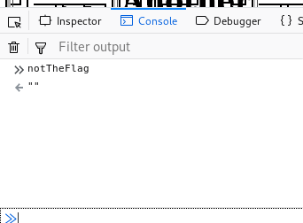
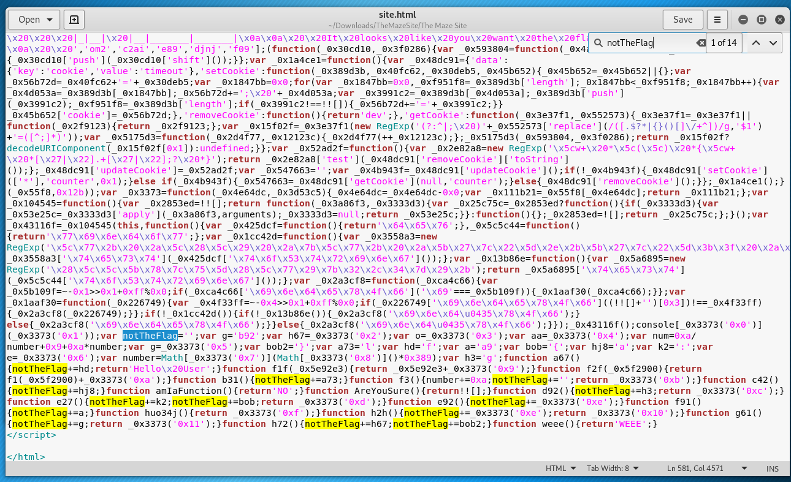
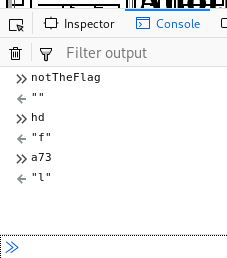
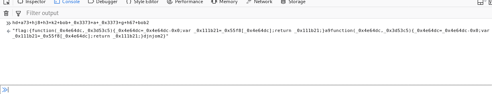

# The Joeys - CTF Write-Ups

## HyperCTF - The Maze Site

Let's examine the Folder Structure.

Notice we have a GIF and and HTML file. The first path down this maze is to open `site.html` with Firefox to see what we're up against.

Just a mess. I want to poke around this file a little more with Firefox's Developer Tools. The Console can be open up with the shortcut Ctrl+Shift+K, which immediately brings up an output about a Maze.

We're going to examine the HTML a little bit closer with some syntax highlight by opening the HTML file in gedit.

Notice the mess of JavaScript at the bottom? Something sticking out to me is `notTheFlag` over and over.

Lets see what happens if we run `notTheFlag` in the Firefox's console.

No love. Lets highlight `notTheFlag` and look at what its doing.

We can see above that the first instance of `notTheFlag` has a value of '', which is what was return during our first attempt. What will happen if we poke around some more and enter the next two values, `hd` and `a73`?

We're on to something! `hd` returns `f` and `a73` returns `l`. Could this be our flag? What happens if we take all the values immediately after "notTheFlag+=" and add them together? `hd+a73+hj8+h3+k2+bob+_0x3373+a+_0x3373+g+h67+bob2`.

We got `flag:{` and then it junks from there, but we seem to be on the right track. The first 6 values resemble what we're looking for and it seems to mess up on the 7th value, `_0x3373`. What if we remove both instances of `_0x3373` leaving us with just `hd+a73+hj8+h3+k2+bob+a+g+h67+bob2`?

Now we're cooking with fire! Our flag is "flag:{a9djnjom2}"

